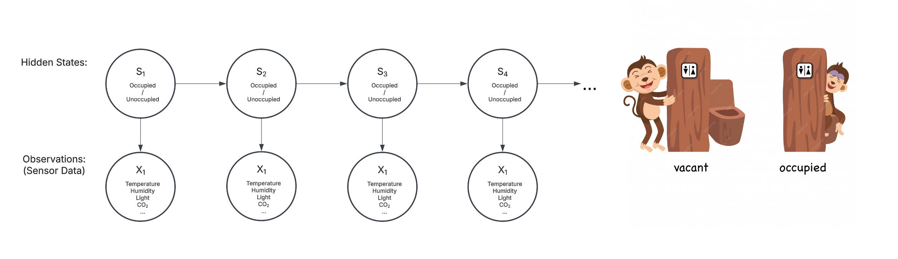
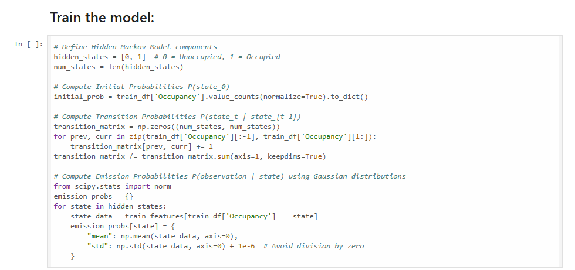
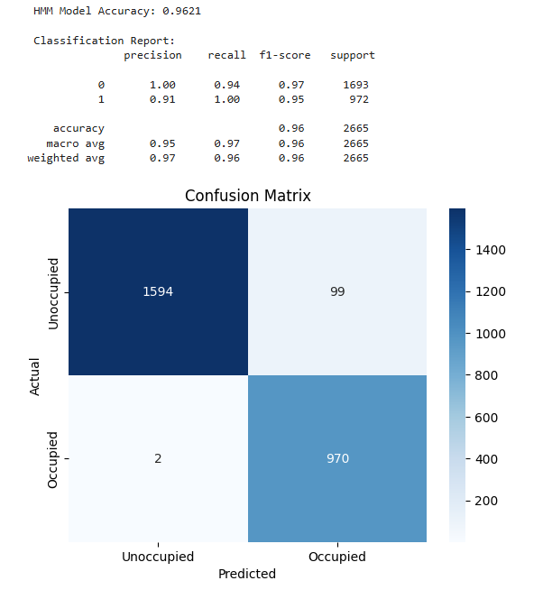

# Milestone 3: Final Project

[LINK TO MODEL 2](./model2.ipynb)

### Data Preprocessing
Our dataset, sourced from Kaggle, is well-formatted and requires minimal preprocessing. We parse the CSV file and store each column in a Pandas DataFrame for easier manipulation. 

The dataset consists of **17,895 observations** and **8 columns**, including environmental metrics (**Temperature, Humidity, Light, CO2, HumidityRatio**), a date column, an ID, and an **Occupancy** column. The goal is to predict occupancy based on environmental factors. Features like **Light, CO2, and HumidityRatio** are strongly correlated with occupancy and serve as key predictive variables. 

### Overview of Each Variable

Below is a brief description of each variable in our dataset and how it contributes to the **HMM**‐based occupancy detection model. The figure below illustrates how our hidden state (occupancy) is inferred from these observed variables.

1. **Temperature**  
   Represents the ambient temperature (in °C). While temperature alone may not strongly indicate occupancy, it can rise slightly with more people present or when HVAC systems respond to occupancy.

2. **Humidity**  
   Indicates the amount of water vapor in the air. Occupants breathing or changes in ventilation can cause subtle variations in humidity levels.

3. **Light**  
   Measures the brightness in the room (in Lux). This feature is often highly indicative of occupancy since people typically turn on lights when a room is in use.

4. **CO₂**  
   Carbon dioxide concentration (in ppm). Occupants exhale CO₂, so higher levels typically correlate with more people in a confined space.

5. **HumidityRatio**  
   A derived measure combining temperature and humidity. This ratio can provide an additional signal related to air quality, which may change with human presence.

6. **Date**  
   Records the date and time of each observation. While not directly modeled in our HMM emissions, it could be used for *contextual* or *time‐based* features (e.g., detecting occupancy patterns over the workday).

7. **ID**  
   An identifier for each observation (or sensor reading). Primarily used for data management and not directly in the predictive model.

8. **Occupancy**  
   The ground‐truth label indicating whether the room was occupied (1) or unoccupied (0). In our Hidden Markov Model, this is the *hidden state* we aim to infer from the sensor variables.

---

**Figure:** Simplified diagram of our HMM. The hidden states $S_1, S_2, \dots$ represent room occupancy (occupied/unoccupied), while the observed variables $X_1, X_2, \dots$ are the sensor readings (temperature, humidity, light, CO₂, etc.). The transition probabilities $P(S_t \mid S_{t-1})$ capture how occupancy evolves over time, and the emission probabilities $P(X_t \mid S_t)$ describe how likely each sensor reading is, given a particular occupancy state.

### Model Description:
We structured our model as a **Hidden Markov Model (HMM)**, where the hidden states represent **room occupancy (occupied/unoccupied)**, and the observed variables are environmental sensor readings. The model assumes that occupancy states evolve over time and that each sensor reading is probabilistically dependent on the hidden state at that moment.

We selected HMM because:
- Occupancy follows temporal patterns, making HMM well-suited for modeling sequential dependencies.
- The **Viterbi algorithm** allows us to infer the most likely sequence of occupancy states given the sensor data.

### Training:
Instead of using a Naïve Bayes approach, we now estimate the following HMM parameters:

- **Initial State Probabilities ($\pi$):** Estimated from the proportion of occupied vs. unoccupied instances in the dataset.
- **Transition Probabilities ($A$):** Computed from observed state transitions over time.
- **Emission Probabilities ($B$):** Modeled using **Gaussian distributions** to represent the probability of sensor readings given an occupancy state.

We use:
- **Maximum Likelihood Estimation (MLE)** to determine initial and transition probabilities.
- **Gaussian Mixture Models (GMM)** to estimate emission probabilities for continuous sensor features. For instance, light levels under “occupied” conditions might cluster around several different values (e.g., bright overhead lighting, partial daylight, etc.) rather than following a single bell‐shaped curve. A Gaussian Mixture Model lets us represent each hidden state’s emission probability as a weighted sum of multiple Gaussian components, capturing data that are not well described by just one Gaussian. In the context of our HMM, each hidden state (occupied/unoccupied) has its own GMM that defines the probability of observing certain sensor readings (emissions). This flexibility helps our model learn more nuanced patterns in the data, which ultimately improves occupancy inference compared to assuming a single Gaussian distribution per state.

### Conditional Probability Tables (CPTs)

Instead of Naïve Bayes conditional probability tables, our CPTs now describe the entire HMM structure:

- **Initial State Distribution ($\pi$)**  
  The probability of being in each hidden state at the first timestep, $P(S_0)$.

- **Transition Probabilities ($A$)**  
  The probability of moving from one hidden state to another, $P(S_t \mid S_{t-1})$.

- **Emission Probabilities ($B$)**  
  The probability distributions governing how the sensor observations relate to hidden occupancy states, $P(X_t \mid S_t)$.

Together, these components define the model’s conditional probability tables. Our **emission CPTs** reflect how temperature, humidity, light, and CO₂ values are generated by each occupancy state; the **transition CPT** encodes how occupancy evolves over time; and the **initial state distribution** indicates the likelihood of starting in each occupancy state. We include detailed tables and computations for all of these in our [Jupyter Notebook](./model2.ipynb).

## Agent Definition
As smart building technology advances, real-time room occupancy detection is crucial for optimizing energy usage and space management. This project presents a probabilistic AI-driven approach using environmental sensor data, including **temperature, humidity, light levels, and CO₂ concentrations**.

Instead of using a standard classification model, we employ a **Hidden Markov Model** to capture **sequential dependencies** in sensor readings. This enables more accurate occupancy predictions by dynamically updating probability estimates as new data arrives.

### Utility-Based Decision Making
The agent evaluates environmental sensor readings to determine the probability of room occupancy. The **Viterbi algorithm** is used to infer the most likely occupancy state sequence over time.

### Probabilistic Modeling
HMM is used as a probabilistic graphical model where **hidden states (occupancy)** are inferred from **observations (sensor data)**. Unlike static classifiers, this model continuously refines predictions as new sensor values are observed.

## Conclusion

Our HMM‐based approach has substantially improved upon our earlier model (now 96.21% accurate compared to a previous 66.98%) by capturing **time‐series dependencies** in the occupancy data. Unlike static classifiers, the HMM’s **transition probabilities** link occupancy states across consecutive timesteps, making the system more robust to noise and better able to handle gradual transitions (for instance, people entering or leaving a room). This temporal aspect helps smooth out momentary sensor spikes or dips, ultimately **boosting predictive accuracy** over the simpler model.

Looking at our **accuracy metrics** and the **confusion matrix**, we see fewer misclassifications than in our Naïve Bayes–based approach, confirming that leveraging sequential patterns makes a difference. Performance does vary based on which sensors we include—light and CO₂ data appear particularly influential—so our final evaluation compares different subsets of sensors to see which combination yields the greatest improvement. 

### Potential Improvements: 
Beyond the current version, potential future work could involve:
- Increasing the number of hidden states (e.g., representing “room partially occupied” vs. “fully occupied”).
- Incorporating **time‐of‐day** or **day‐of‐week** features to capture predictable daily/weekly occupancy cycles.

## Libraries Used
- `pgmpy` for HMM modeling [(pgmpy Documentation)](https://pgmpy.org/)
- `scikit-learn` for data preprocessing [(scikit-learn)](https://scikit-learn.org/)
- `seaborn` & `matplotlib` for visualization
- Utilized GenAI to help decide which of the models we learned would best represent our data, and helped with pseudo-code.

---
# Milestone 2: Build First Agent

## Update: 
We added data preprocessing, model description, training, and CPTs sections based on gradescope feedback

### Data Preprocessing
Fortunately our dataset found on Kaggle is formatted well and does not require major preprocessing. However we did parse the csv file and store each column in its own Pandas Dataframe, as it is easy to perform operations on them this way. 

The dataset consists of 17,895 observations and 8 columns. The features include environmental metrics (Temperature, Humidity, Light, CO2, HumidityRatio), a date column, an id, and an Occupancy column. This dataset is well-suited for a classification problem, where the goal would be to predict Occupancy based on environmental factors. Since Light, CO2, and HumidityRatio are likely correlated with Occupancy, they may serve as strong predictive features.

### Model Description: 
Our model is structured as a **Naïve Bayes classifier**, where temperature serves as the primary feature for predicting room occupancy. The model assumes that the probability of occupancy given a temperature value follows the principles of **Bayes' Theorem**, meaning that we compute the likelihood $P(\text{Temperature} | \text{Occupancy})$, multiply it by the prior $P(\text{Occupancy})$, and normalize to obtain the posterior probability $P(\text{Occupancy} | \text{Temperature})$.

The correlations in the model are based on the observed relationship between temperature and occupancy in the training data. If higher temperatures are more likely when the room is occupied, the model captures this trend through the **likelihood function**. Since we grouped temperature into bins (`Temperature_group`), the model makes predictions by finding the closest temperature bin and comparing the probabilities of occupancy $P(1)$ and non-occupancy $P(0)$. This structure allows our model to generalize well by leveraging **conditional probabilities**, rather than making direct assumptions about the linearity of the relationship between temperature and occupancy.

### Training:
We trained our model using **Bayes’ Theorem** to predict room occupancy based on temperature. First, we discretized the `Temperature` variable into bins (`Temperature_group`) and computed the **likelihood** $ P(\text{Temperature} | \text{Occupancy}) $ by grouping the training data and normalizing the counts for each occupancy class. Next, we calculated the **prior probability** of occupancy $ P(\text{Occupancy}) $ by finding the proportion of occupied and unoccupied instances in the dataset. Using Bayes’ Theorem, we then derived the **posterior probability** $ P(\text{Occupancy} | \text{Temperature}) $ by multiplying the likelihood with the prior and normalizing the values so that probabilities sum to 1. Finally, we implemented a prediction function that takes a given temperature, finds the closest bin, retrieves the corresponding probabilities, and assigns the occupancy class with the highest probability. This approach allows for probabilistic predictions based on historical temperature distributions in the training data.

### CPTs: 
We calculated CPTs for all the columns in our dataset and the relationship they had conditionally to occupancy. These CPTs are included in our jupyter notebook linked [here](./Model1.ipynb). 

## Agent Definition
As smart building technology advances, real-time room occupancy detection is crucial for optimizing energy usage and space management. This project presents a probabilistic AI-driven approach to inferring room occupancy using environmental sensor data, including temperature, humidity, light levels, and CO₂ concentrations. Instead of relying on traditional machine learning classification models, we employ a Bayesian network to model the probabilistic dependencies between sensor readings and occupancy states. By structuring the problem within a probabilistic graphical model, we can dynamically update occupancy predictions as new data arrives, enabling robust inference under uncertainty.

Our approach leverages conditional probability distributions to incorporate prior knowledge about environmental variations and sensor reliability. Results from the Occupancy Detection dataset demonstrate the effectiveness of Bayesian inference in distinguishing occupied and unoccupied states with high accuracy. The proposed system could be integrated into Geisel’s existing room utilization display system, improving real-time space management. This research contributes to smart infrastructure by providing a scalable, uncertainty-aware solution for automated occupancy tracking, with potential applications in energy-efficient climate control and room allocation.

### Utility Based 
Agent makes decisions based on a utility function that evaluates different environmental sensor readings - such as temperature, humidity, and CO₂ levels - to determine the probability of a room being at maximum occupancy.

### Probabilistic Modeling
Our model is based on a Bayesian network, which utilizes conditional probability distributions to define the likelihood of different sensor values given occupancy states. The network dynamically updates its beliefs as new environmental data arrives, allowing it to make more informed occupancy predictions in real time.

### Conclusion Section
The model achieved an accuracy of **66.98%**, based **solely on temperature** indicating moderate predictive performance. However, the classification report suggests significant imbalances in precision and recall across classes, which affects overall reliability.

The model is effective at identifying unoccupied rooms, but its precision could be improved.
- 68% of predicted unoccupied rooms were actually unoccupied)
- 91% of actual unoccupied rooms were correctly identified
 
Model struggles significantly with detecting occupied rooms. It misses a large proportion of occupied cases, leading to false negatives.
- 26% of actual occupied rooms were correctly identified
- 61% of predicted occupied rooms were actually occupied

To improve performance over the next few iterations, we will analyze several different metrics concurrently (such as humidity, light levels, and CO₂. Additionally, using a more complex model could potentially provide more accurate predicitons.

[View Model 1 Notebook](./Model1.ipynb)
